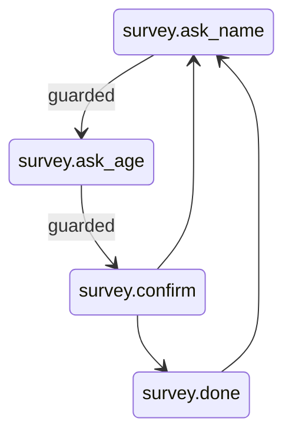

# Survey Bot Example

The canonical example for this library: a chat bot that asks a few questions, one webhook request
at a time, with no state kept in memory between requests.

Each incoming message goes through the same steps:

1. `Session::resume()` builds a fresh `StateMachine`, loads the snapshot for the chat from a
   `SnapshotStoreInterface`, or starts the machine in `survey.ask_name` when the chat is new.
2. `tick()` applies the message. States reply by emitting `BotReply` events and move on with
   `CycleResponse::transitionTo()`; the next state asks its question from `onEnter()`.
3. `persist()` writes the new snapshot back to the store.
4. The collected `BotReply` texts are returned to the transport layer.



Guards on the table make illegal jumps impossible: the machine refuses to enter `survey.ask_age`
until `name` is set, and the whole tick rolls back if that ever happens.

Run it with:

```bash
php examples/survey-bot/run.php
```

`FileSnapshotStore` in this example writes one JSON file per chat. Replace it with a database-backed
implementation of `SnapshotStoreInterface` in a real deployment.

See [docs/sessions.md](../../docs/sessions.md) for the request cycle and
[docs/getting-started.md](../../docs/getting-started.md) for the step-by-step walk-through.
