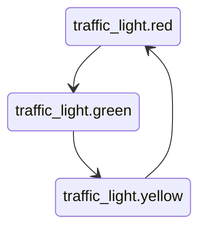

# Traffic Light Example

The classic state-machine demo, used here to show the runtime features that the simple workflow
does not need:

- a declared `TransitionTable` (red -> green -> yellow -> red) rendered as a Mermaid diagram
- three states sharing one `AbstractState` subclass (`LightState`)
- a domain command that is also a transition (`ChangeColorCommand`)
- a listener that observes the committed context after the transition
- `TickCompleted` for per-tick reporting
- a clock injected through `Psr\Clock\ClockInterface` so output is deterministic in tests
- snapshot, JSON round trip, and resumed execution in a fresh application instance



Run it with:

```bash
php examples/traffic-light/run.php
```

Read [docs/transitions.md](../../docs/transitions.md) and [docs/snapshots.md](../../docs/snapshots.md) for the concepts used here.
